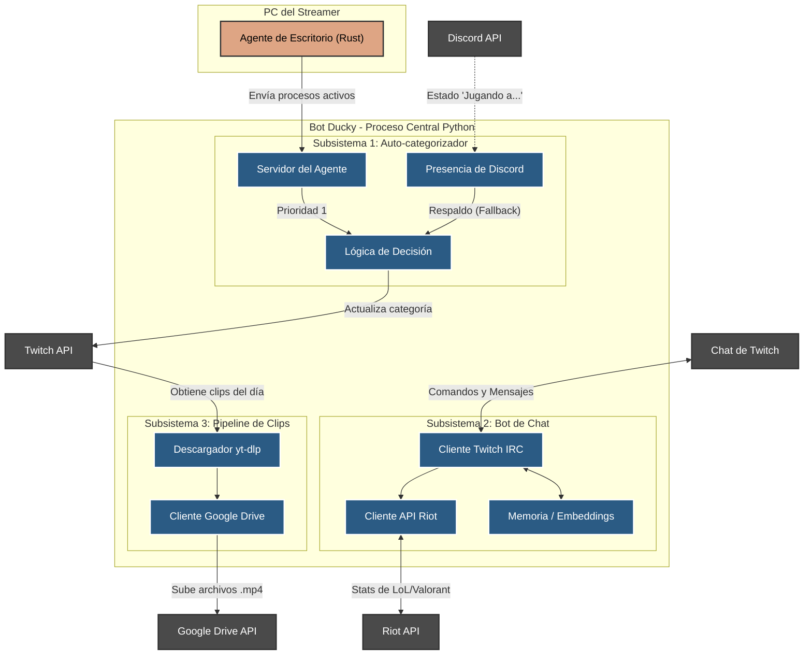

# Arquitectura General del Sistema

Este diagrama ilustra los tres subsistemas principales descritos en el proyecto y cómo interactúan con servicios externos (Twitch, Discord, Riot, Google Drive y el Agente de escritorio) ejecutándose todos dentro del mismo proceso de Python.

