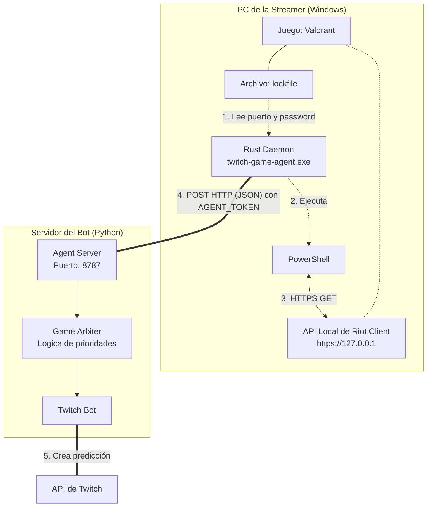
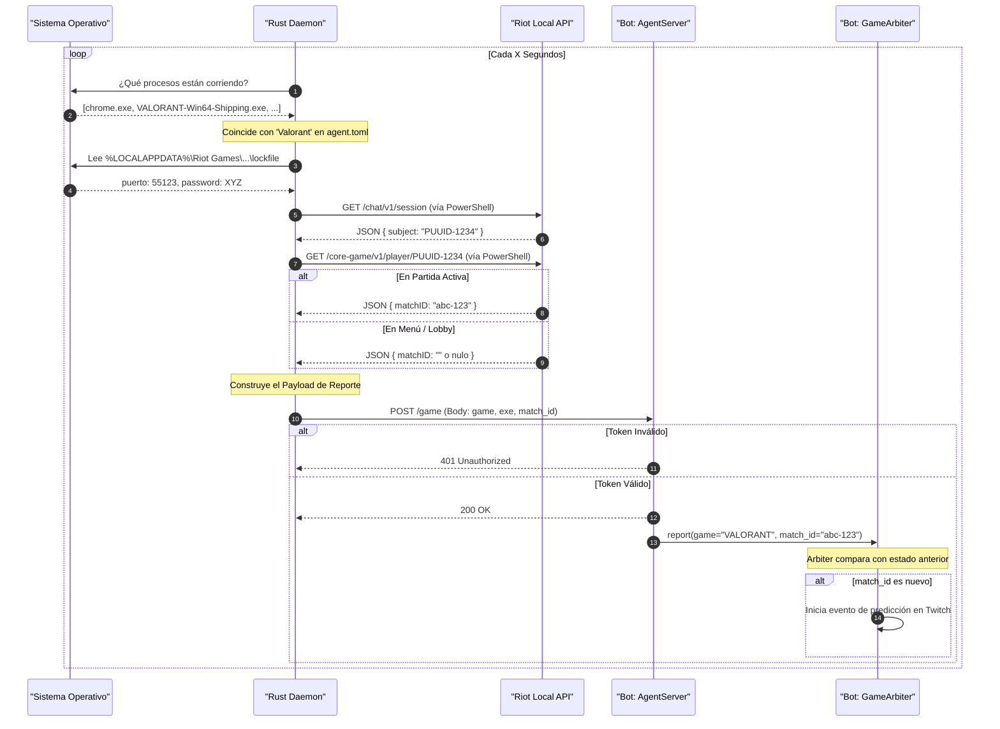

# Arquitectura y Flujo: Detección de Valorant

Este documento describe cómo se comunican los distintos componentes del sistema para lograr detectar partidas de Valorant en la PC de la streamer y reportarlas al bot principal.

## Diagrama de Arquitectura de Red

El siguiente diagrama muestra los componentes físicos y de software involucrados. El agente (Daemon) corre en la computadora de la streamer, mientras que el Bot principal corre en un servidor o máquina separada. La comunicación se realiza a través de la red local o una VPN como Tailscale.



---

## Diagrama de Secuencia (Flujo Lógico)

Este diagrama detalla exactamente qué sucede cada `X` segundos (configurado por `poll_seconds` en el `agent.toml`).



## Resumen del Payload JSON
Cuando el Agente se comunica con el servidor, envía un cuerpo JSON como este:

```json
{
  "source": "agent",
  "game": "VALORANT",
  "match_id": "8b51c8b3-1234-5678-abcd-ef0123456789",
  "exe": "VALORANT-Win64-Shipping.exe",
  "host": "DESKTOP-STREAMER",
  "agent_version": "0.1.0",
  "sent_at": "2026-09-17T23:58:00Z"
}
```

> [!TIP]
> Si el juego es detectado pero no hay una partida activa (la streamer está en el lobby o buscando), el campo `match_id` se envía como `null`. El bot entiende esto como "Valorant está abierto, pero todavía no hay que crear una predicción".
