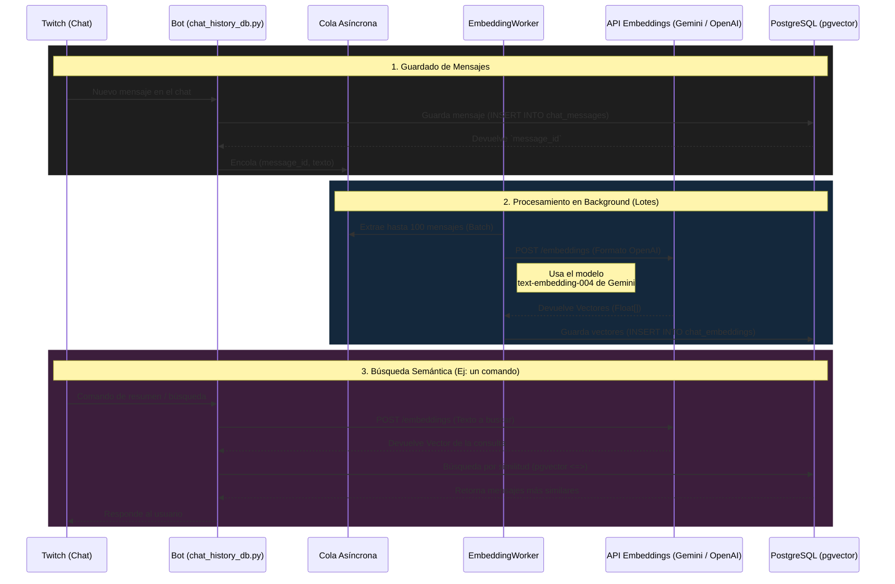

# Flujo de Embeddings de Chat

Aquí tienes el diagrama que explica cómo funciona el flujo de embeddings en el proyecto. 

```mermaid
sequenceDiagram
    participant T as Twitch (Chat)
    participant B as Bot (chat_history_db.py)
    participant Q as Cola Asíncrona
    participant W as EmbeddingWorker
    participant API as API Embeddings (Gemini / OpenAI)
    participant DB as PostgreSQL (pgvector)
    
    %% Flujo de Guardado
    rect rgb(30, 30, 30)
    Note over T,DB: 1. Guardado de Mensajes
    T->>B: Nuevo mensaje en el chat
    B->>DB: Guarda mensaje (INSERT INTO chat_messages)
    DB-->>B: Devuelve `message_id`
    B->>Q: Encola (message_id, texto)
    end
    
    %% Flujo del Worker (Background)
    rect rgb(20, 40, 60)
    Note over Q,DB: 2. Procesamiento en Background (Lotes)
    W->>Q: Extrae hasta 100 mensajes (Batch)
    W->>API: POST /embeddings (Formato OpenAI)
    Note right of W: Usa el modelo<br/>text-embedding-004 de Gemini
    API-->>W: Devuelve Vectores (Float[])
    W->>DB: Guarda vectores (INSERT INTO chat_embeddings)
    end
    
    %% Flujo de Búsqueda Semántica
    rect rgb(60, 30, 60)
    Note over T,DB: 3. Búsqueda Semántica (Ej: un comando)
    T->>B: Comando de resumen / búsqueda
    B->>API: POST /embeddings (Texto a buscar)
    API-->>B: Devuelve Vector de la consulta
    B->>DB: Búsqueda por similitud (pgvector <=>)
    DB-->>B: Retorna mensajes más similares
    B-->>T: Responde al usuario
    end
```
